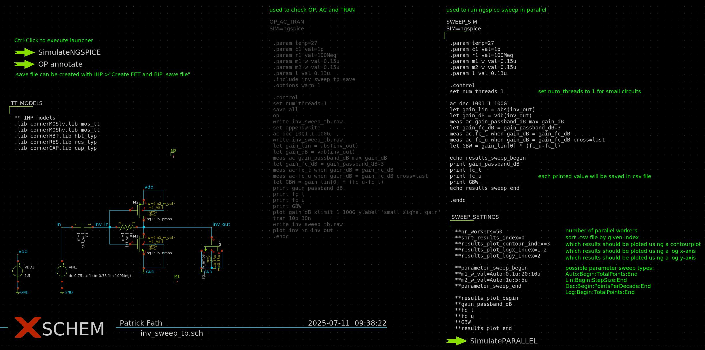
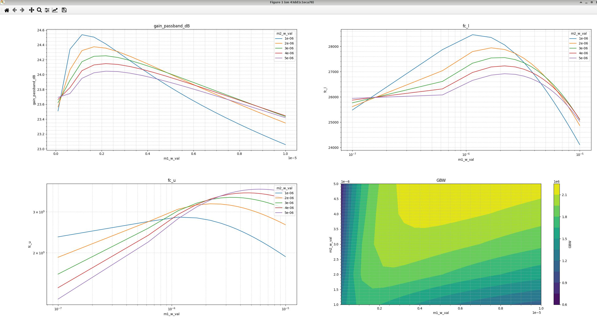
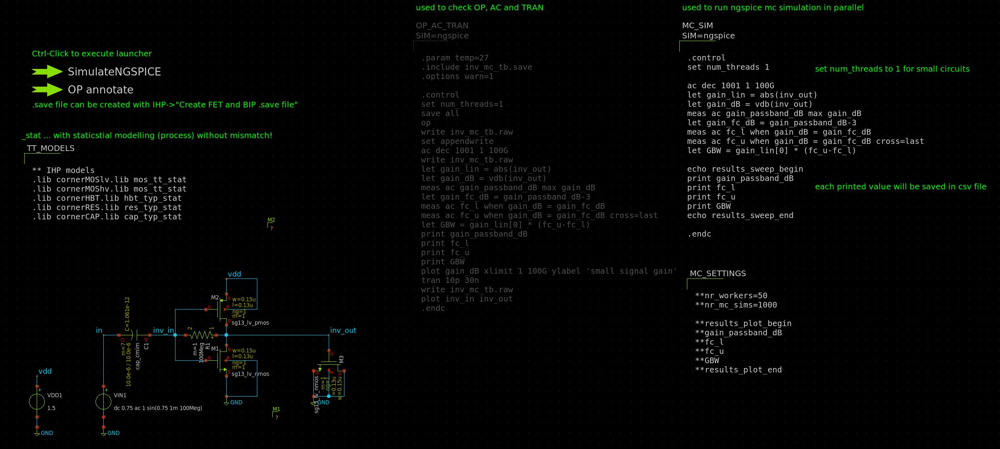
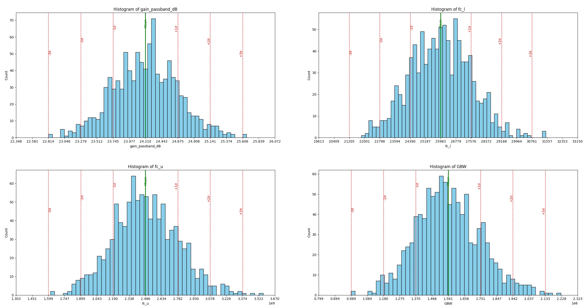

# osic-tool-collection

## Parameter Sweep with Ngspice
Strg + Left click on SimulatePARALLEL in schematic to start run!
### inv_sweep_tb.sch
Example schematic for parallelisation of parameter sweeps with ngspice. IHP-SG13G2 PDK is used in this example.
### ngspice_parallel_sweep.py
Python tool for parallelisation of parameter sweeps with ngspice

## Monte-Carlo Simulation with Ngspice
Strg + Left click on SimulatePARALLEL in schematic to start run!
### inv_mc_tb.sch
Example schematic for parallelisation of Monte-Carlo simulations with ngspice IHP-SG13G2 PDK is used in this example.
### ngspice_parallel_mc.py
Python tool for parallelisation of Monte-Carlo simulations with ngspice

