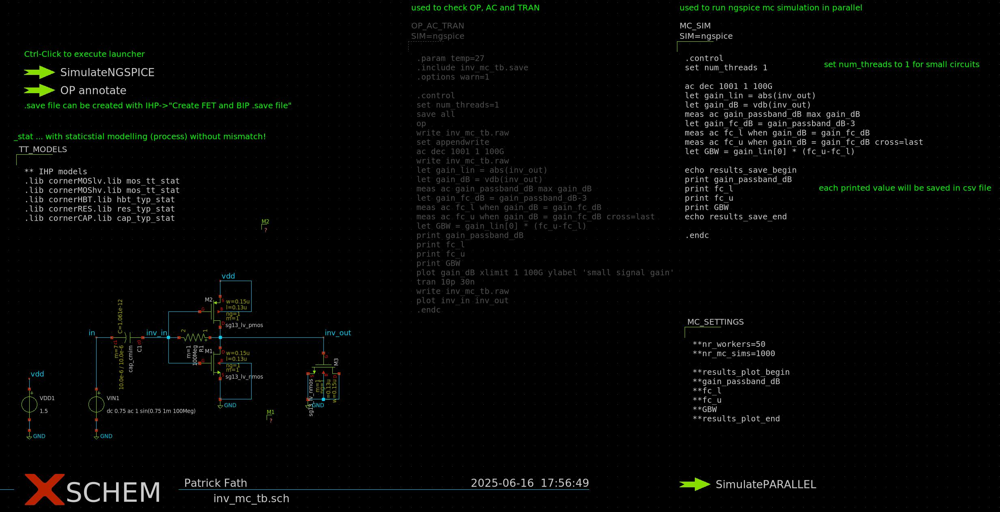

# osic-tool-collection

## Parameter Sweep with Ngspice
Strg + Left click on SimulatePARALLEL in schematic to start run!
* The number of parallel workers is adjustable
* The given index can sort the result CSV file
* Plot options available for 1 or 2 swept variables
* Switch to plot selected results as a contour plot or a normal plot based on the given index
* Switch to plot selected results as a semilogx plot, a semilogy plot, a loglog plot, or a normal plot based on the given index
* Different sweep types implemented:
  * Automatic:   Auto:Begin:TotalPoints:End
  * Linear:      Lin:Begin:StepSize:End
  * Decade:      Dec:Begin:PointsPerDecade:End
  * Logarithmic: Log:Begin:TotalPoints:End
### inv_sweep_tb.sch
Example schematic for parallelisation of parameter sweeps with ngspice. IHP-SG13G2 PDK is used in this example.
### ngspice_parallel_sweep.py
Python tool for parallelisation of parameter sweeps with ngspice

## Monte-Carlo Simulation with Ngspice
Strg + Left click on SimulatePARALLEL in schematic to start run!
### inv_mc_tb.sch
Example schematic for parallelisation of Monte-Carlo simulations with ngspice IHP-SG13G2 PDK is used in this example.
### ngspice_parallel_mc.py
Python tool for parallelisation of Monte-Carlo simulations with ngspice

